# Knowledge graph — overview

Category-to-proposition edges aggregated from per-record annotations in `graph.json` (solid = supports, dashed = complicates/contradicts, plain = relates). Edge labels give the record count. Annotations are AI-drafted and verifier-checked readings of abstracts, not the authors' own claims.

```mermaid
graph LR
  C01["01 Burden of intimate-partner violence and primary-prevention frameworks"]
  C02["02 Premarital and relationship education: measured outcomes"]
  C03["03 Screening, first-line response and referral"]
  C04["04 Couple-based work and coercive control"]
  C05["05 Decision autonomy, reproductive coercion and measurement instruments"]
  C06["06 Muslim populations, Thailand and Southeast Asia"]
  C07["07 Multicultural clinical safety and language access"]
  C08["08 Preconception medicine, premarital screening and adjacent guidance"]
  C09["09 Global guidance, frameworks and methods"]
  C10["10 Thailand and the southern border provinces"]
  C11["11 Premarital knowledge and well-being pathways"]
  C12["12 Culture as a health determinant and intercultural coexistence"]
  C13["13 Digital self-assessment and safety decision aids for intimate-partner violence"]
  C14["14 Peer online support, moderated communities and digital safe spaces"]
  C15["15 Assessor independence, risk assessment and check-in models"]
  C16["16 Recognition of coercive control and psychological manipulation; inoculation"]
  C17["17 Humility, compassion, self-regulation and responsibility: psychological and health evidence"]
  C18["18 Islamic medical ethics and spirituality in Muslim health care (tier-one sources only)"]
  P1["P1: A governance layer improves decision control beyond content-only education"]
  P2["P2: A routine private channel makes materially relevant concerns more visible"]
  P3["P3: Cultural intelligibility helps only when culture cannot override consent or safety"]
  P4["P4: A stop rule prevents routine joint education from worsening risk when fear or coercion appears"]
  P5["P5: Referral quality depends on timeliness, accessibility and follow-through, not offer alone"]
  P6["P6: Conventional programme success can coexist with T-PHE failure"]
  P7["P7: Repairability is necessary because relevant information emerges over time"]
  C01 ---|relates_to x2| P1
  C01 -->|supports x5| P1
  C01 -->|supports x2| P2
  C01 ---|relates_to x1| P3
  C01 -->|supports x1| P3
  C01 ---|relates_to x1| P4
  C01 -.->|complicates x1| P5
  C01 ---|relates_to x2| P5
  C01 -->|supports x1| P5
  C01 -->|supports x1| P7
  C02 -.->|complicates x2| P1
  C02 ---|relates_to x2| P1
  C02 -->|supports x1| P1
  C02 -->|supports x3| P2
  C02 -->|supports x3| P3
  C02 -.->|complicates x1| P4
  C02 -->|supports x2| P4
  C02 -->|supports x3| P5
  C02 -.->|complicates x1| P6
  C02 ---|relates_to x1| P6
  C02 ---|relates_to x1| P7
  C02 -->|supports x1| P7
  C03 ---|relates_to x1| P1
  C03 -->|supports x2| P1
  C03 ---|relates_to x1| P2
  C03 -->|supports x2| P2
  C03 -->|supports x1| P3
  C03 -->|supports x4| P4
  C03 -.->|complicates x2| P5
  C03 ---|relates_to x2| P5
  C03 -->|supports x7| P5
  C04 ---|relates_to x1| P1
  C04 -->|supports x2| P1
  C04 -.->|complicates x1| P2
  C04 -->|supports x5| P2
  C04 -->|supports x1| P3
  C04 -.->|complicates x2| P4
  C04 ---|relates_to x1| P4
  C04 -->|supports x3| P4
  C04 ---|relates_to x1| P5
  C04 -->|supports x4| P5
  C05 -.->|complicates x1| P1
  C05 ---|relates_to x2| P1
  C05 -->|supports x8| P1
  C05 ---|relates_to x1| P2
  C05 -->|supports x1| P2
  C05 -.->|complicates x2| P3
  C05 -->|supports x2| P3
  C05 -.->|complicates x1| P4
  C05 -->|supports x2| P4
  C05 ---|relates_to x1| P5
  C05 -->|supports x2| P5
  C05 ---|relates_to x1| P7
  C05 -->|supports x1| P7
  C06 -.->|complicates x2| P1
  C06 -->|supports x13| P1
  C06 -->|supports x1| P2
  C06 -.->|complicates x1| P3
  C06 -->|supports x4| P3
  C06 -->|supports x6| P4
  C06 -->|supports x5| P5
  C06 -.->|complicates x1| P6
  C06 -->|supports x3| P6
  C06 -->|supports x1| P7
  C15 -.->|complicates x1| P5
  C15 ---|relates_to x1| P5
  C15 -->|supports x3| P5
```

